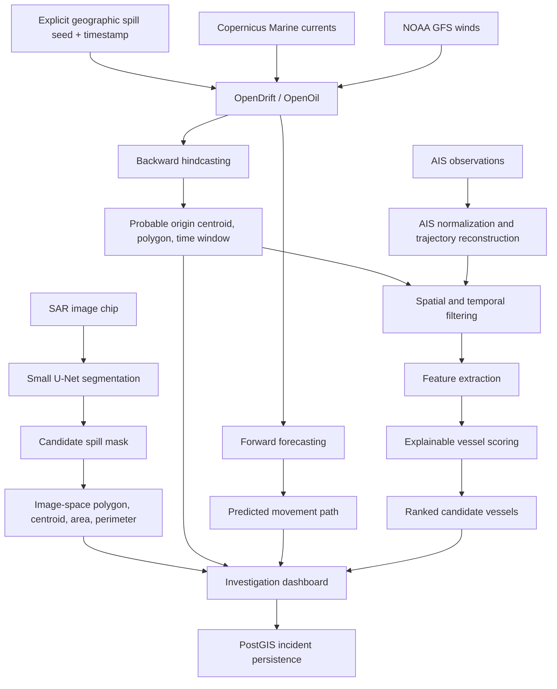
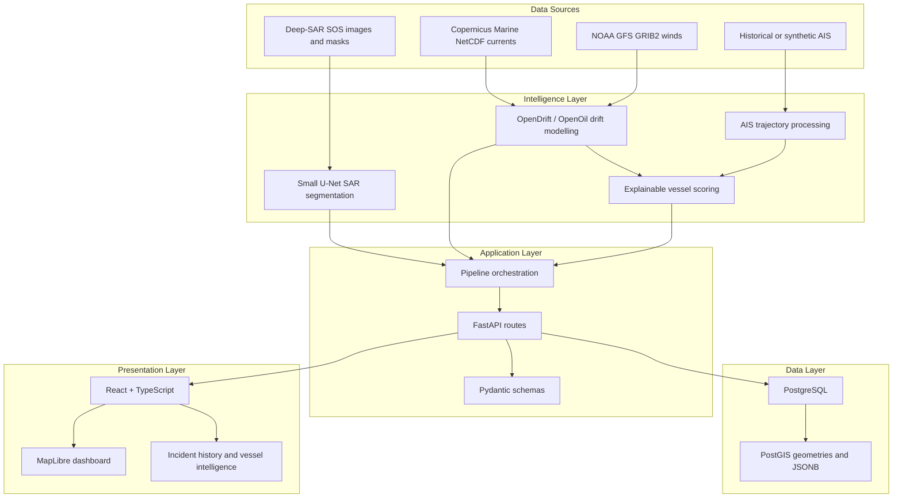

# MARIS

### Marine AI for Reconnaissance, Investigation & Spill Attribution

**Smart India Hackathon 2026 - PS 26143**

> AI-Powered Marine Oil Spill Detection, Hindcasting, Drift Forecasting & Explainable Vessel Attribution

MARIS combines deep-learning SAR oil-spill segmentation, physics-based drift modelling, and explainable AIS analytics to reconstruct probable spill origins and prioritize candidate vessels for investigation.

**Detect -> Hindcast -> Forecast -> Correlate -> Investigate**

---

## Table Of Contents

- [Overview](#overview)
- [Problem Statement](#problem-statement)
- [Why MARIS?](#why-maris)
- [Proposed Solution](#proposed-solution)
- [Key Features](#key-features)
- [End-To-End Workflow](#end-to-end-workflow)
- [System Architecture](#system-architecture)
- [AI Oil-Spill Detection](#ai-oil-spill-detection)
- [Hindcasting And Forecasting](#hindcasting-and-forecasting)
- [AIS Vessel Intelligence](#ais-vessel-intelligence)
- [Explainable Vessel Attribution](#explainable-vessel-attribution)
- [Vessel Trajectory Visualization](#vessel-trajectory-visualization)
- [Technology Stack](#technology-stack)
- [Datasets And Data Sources](#datasets-and-data-sources)
- [ML Training And Results](#ml-training-and-results)
- [Backend API](#backend-api)
- [Database](#database)
- [Frontend](#frontend)
- [Project Structure](#project-structure)
- [Installation](#installation)
- [Running MARIS](#running-maris)
- [Demo Scenario](#demo-scenario)
- [Real AIS Validation](#real-ais-validation)
- [Testing](#testing)
- [Research And References](#research-and-references)
- [Scientific Integrity](#scientific-integrity)
- [Current Limitations](#current-limitations)
- [Future Work](#future-work)
- [Documentation](#documentation)
- [Smart India Hackathon 2026](#smart-india-hackathon-2026)

---

## Overview

MARIS is a software prototype for maritime oil-spill investigation. It links satellite-image segmentation, drift hindcasting, forward forecasting, AIS trajectory reconstruction, candidate-vessel scoring, and PostGIS-backed incident history into one investigation workflow.

The system is designed to support analysts, not replace scientific or legal review. It highlights where a suspected slick may have originated, where it may move, which vessels were relevant to the reconstructed origin window, and why each vessel was ranked.

## Problem Statement

**Problem Statement ID:** PS 26143
**Problem:** Marine oil spills can cause severe ecosystem damage while the vessel responsible may remain unidentified.

The investigation challenge has three connected parts:

| Challenge | Question |
|---|---|
| Detection | Can suspected oil slick regions be found from satellite observations? |
| Source reconstruction | Where and when might the slick have originated before currents and wind moved it? |
| Attribution | Which vessels crossed the probable origin region and time window, and why were they prioritized? |

## Why MARIS?

Oil-spill response is not only a detection problem. Investigators also need to reason backward from the observed slick, forecast likely movement, compare vessel histories against the reconstructed origin, and preserve a transparent chain of evidence.

MARIS addresses that gap by combining pixel-level segmentation, hindcasting, environmental forcing, AIS analytics, and an interactive geospatial dashboard. Its output is a ranked investigative aid, never a legal finding.

## Proposed Solution

MARIS follows a five-stage workflow:

1. **Detect:** locate candidate oil-spill regions from SAR imagery.
2. **Hindcast:** model motion backward in time to estimate a probable origin region and release-time window.
3. **Forecast:** model likely future movement from the detected spill seed.
4. **Correlate:** reconstruct AIS vessel trajectories near the estimated origin area and time window.
5. **Investigate:** rank candidate vessels with explainable, deterministic evidence factors.

**Detect -> Hindcast -> Forecast -> Correlate -> Investigate**

## Key Features

- Deep-learning SAR oil-spill segmentation using a compact U-Net.
- Pixel-level candidate spill mask, image-space centroid, area in pixels, perimeter in pixels, and polygon extraction.
- Drift hindcasting and forward forecasting from an explicit geographic spill seed.
- OpenDrift/OpenOil integration with native-grid real environmental forcing.
- Copernicus Marine current integration and NOAA GFS 10 m wind integration.
- Historical AIS ingestion, normalization, trajectory reconstruction, filtering, and scoring.
- Deterministic synthetic AIS mode for the Mumbai demo scenario.
- Explainable candidate-vessel ranking with per-factor score breakdown.
- Candidate vessel trajectory visualization from the same AIS observations used by the scoring engine.
- Incident persistence through PostgreSQL/PostGIS.
- Interactive React/TypeScript dashboard with MapLibre maritime visualization.
- Health and provenance reporting for database, model, drift engine, forcing, and AIS mode.

## End-To-End Workflow



## System Architecture



Module A currently returns image-space segmentation. It does **not** produce latitude/longitude. The geographic spill seed used by drift is explicitly supplied until georeferenced SAR input is available.

## AI Oil-Spill Detection

**Model:** Small U-Net
**Framework:** PyTorch
**Task:** binary semantic segmentation
**Input:** SAR image/chip
**Output:** pixel-level candidate oil-spill mask

Segmentation is used because oil-spill investigation needs a region geometry, not only an image-level label. The backend extracts the predicted mask, image-space polygon, centroid, pixel area, and pixel perimeter.

The preferred local production/demo checkpoint is:

```text
backend/models/unet-deep-sar-sos.pth
```

It is selected by:

```env
DETECTION_MODEL_PATH=models/unet-deep-sar-sos.pth
```

If the configured checkpoint is missing, `/detect` returns `model_not_ready` instead of fabricating detection results. SAR look-alikes remain a known limitation.

## Hindcasting And Forecasting

**Hindcasting** runs drift modelling backward in time from the detected spill seed to estimate a probable origin region and time window. **Forecasting** runs forward to estimate probable future movement.

The current real-data path supports:

- `mode=real_data`
- `engine=opendrift_openoil`
- `forcing_strategy=native_grid`
- Copernicus Marine eastward/northward ocean currents
- NOAA GFS 10 m eastward/northward winds

The OpenOil adapter runs backward and forward simulations and returns GeoJSON paths in `[longitude, latitude]` order. Outputs are probable/estimated trajectories, not exact source reconstruction.

## AIS Vessel Intelligence

Module C processes AIS records through:

```text
AIS ingestion -> normalization -> trajectory reconstruction -> time-window filtering -> feature extraction -> scoring -> ranking
```

Required normalized fields are MMSI, timestamp, latitude, longitude, SOG, and COG. Optional fields include vessel name, ship type, heading, and navigation status. The loader supports common aliases such as `LAT`, `LON`, `BaseDateTime`, `SOG`, and `COG`, and parses timestamps as UTC-aware values.

Two modes are supported:

| Mode | Behavior |
|---|---|
| `synthetic_dev` | Deterministic synthetic Mumbai-area tracks for demo and tests. |
| `real_data` | Loads configured AIS CSV, CSV Zstandard, or parquet data from `AIS_DATA_PATH`. Missing or invalid files return `ais_data_not_ready`; there is no silent synthetic fallback. |

## Explainable Vessel Attribution

The vessel attribution module is deterministic algorithmic scoring, not a black-box ML classifier. Candidate vessels are ranked from 0 to 100 using configurable development weights:

| Factor | Weight |
|---|---:|
| Proximity to origin | 30% |
| Temporal proximity | 20% |
| Trajectory alignment | 15% |
| Speed anomaly | 15% |
| Course anomaly | 10% |
| AIS gap | 10% |

Priority bands are development labels:

| Score | Label |
|---:|---|
| 80-100 | High investigative priority |
| 60-79 | Medium investigative priority |
| <60 | Low investigative priority |

AIS gaps are treated as anomaly signals, not proof of wrongdoing. The UI and API use terms such as **candidate vessel**, **ranked suspect**, and **investigative priority**.

## Vessel Trajectory Visualization

Candidate vessel tracks shown on the map are generated from the **same AIS observations used by the attribution and scoring engine**. The frontend does not fabricate client-side vessel tracks.

Each vessel candidate can include:

- `trajectory`: AIS observations used for display.
- `trajectory_source`: `synthetic_dev` or `historical_ais`.

The map enables the Candidate Vessels layer only when backend trajectory coordinates exist.

## Technology Stack

| Layer | Technology | Purpose |
|---|---|---|
| AI/ML | Python, PyTorch, Small U-Net | SAR segmentation and inference |
| Detection utilities | Pillow, OpenCV, NumPy | Image loading, preprocessing, mask post-processing |
| Drift | OpenDrift, OpenOil | Oil-spill hindcasting and forward forecasting |
| Environmental readers | xarray, netCDF4, cfgrib, ecCodes | Copernicus NetCDF and NOAA GFS GRIB2 forcing |
| AIS | Python, Zstandard, deterministic trajectory processing | AIS loading, normalization, filtering, scoring |
| Backend | FastAPI, Pydantic | API contracts and validation |
| Database | PostgreSQL, PostGIS, psycopg | Incident persistence and geospatial storage |
| Frontend | React, TypeScript, Vite, Tailwind CSS, MapLibre GL JS | Investigation dashboard and map visualization |
| Infrastructure | Docker, Docker Compose | Local service orchestration |

## Datasets And Data Sources

| Source | Type | Purpose | Git Policy |
|---|---|---|---|
| Refined Deep-SAR Oil Spill SOS | SAR images + segmentation masks | Module A training and validation | Ignored external dataset |
| Synthetic SAR | Small generated image/mask pairs | Software smoke testing | Small dev asset |
| Copernicus Marine | NetCDF ocean currents | Drift forcing | Ignored external data |
| NOAA GFS | GRIB2 10 m wind | Drift forcing | Ignored external data |
| NOAA / Marine Cadastre AIS | Historical AIS observations | Real AIS ingestion and scoring validation | Raw data ignored |
| Synthetic AIS | Deterministic vessel tracks | Mumbai demo attribution | Generated by code |

See [data/README.md](data/README.md) for expected local folders and data policies.

## ML Training And Results

The full Deep-SAR SOS checkpoint copied locally from Colab was inspected and is compatible with the current inference path.

| Item | Value |
|---|---:|
| Dataset | Refined Deep-SAR Oil Spill SOS |
| Total image-mask pairs | 8,070 |
| Train pairs | 6,455 |
| Validation pairs | 1,615 |
| Image size | 256 x 256 |
| Epochs | 20 |
| Batch size | 16 |
| Learning rate | 1e-4 |
| Loss | BCEWithLogits + Dice |
| Best epoch | 17 |

| Metric | Result |
|---|---:|
| Validation Dice | 80.48% |
| Validation IoU | 67.85% |
| Best validation loss | 0.6857 |
| Validation precision | 77.55% |
| Validation recall | 84.98% |
| Validation F1 | 80.48% |

These are validation segmentation metrics on the Deep-SAR SOS validation split. They should not be interpreted as operational field accuracy.

## Backend API

FastAPI runs from `backend/app/main.py`. Swagger documentation is available at `/docs`.

| Method | Endpoint | Purpose |
|---|---|---|
| GET | `/` | Project identity and API documentation pointer |
| GET | `/health` | Service, database, and OpenDrift health |
| POST | `/detect` | Module A segmentation inference |
| POST | `/drift` | Module B hindcasting and forecasting |
| POST | `/score` | Module C AIS candidate ranking |
| POST | `/pipeline` | Integrated detection, drift, attribution, and optional persistence |
| GET | `/incidents` | List persisted incidents |
| GET | `/incidents/{incident_id}` | Retrieve persisted incident details |
| GET | `/incidents/{incident_id}/vessels` | Retrieve persisted vessel candidates |

## Database

MARIS uses PostgreSQL with PostGIS for incident persistence and geospatial storage. The current schema includes:

| Table | Purpose |
|---|---|
| `incidents` | Pipeline run metadata and provenance |
| `detections` | Detection response JSON |
| `drift_runs` | Seed point, origin geometry, hindcast path, forecast path, and drift JSON |
| `vessel_candidates` | Ranked vessel candidates, factor scores, reasons, trajectory geometry, `trajectory_points` JSONB, and `trajectory_source` |

PostGIS stores SRID 4326 point, polygon, and line geometries so maritime incident history can later support geospatial queries.

## Frontend

The frontend is a React + TypeScript + Vite dashboard with MapLibre map visualization. Current application views include:

- Overview
- New Analysis
- Live Investigation
- Incidents
- Vessel Intelligence
- System Status

The map can render the spill seed, hindcast path, probable origin region, forward forecast, and backend-provided candidate vessel trajectories.

## Project Structure

```text
SIH/
|-- backend/
|   |-- app/
|   |   |-- api/
|   |   |-- core/
|   |   |-- db/
|   |   |-- modules/
|   |   |   |-- attribution/
|   |   |   |-- detection/
|   |   |   |-- drift/
|   |   |   `-- pipeline/
|   |   `-- schemas/
|   |-- models/
|   |-- scripts/
|   `-- requirements.txt
|-- data/
|   |-- ais/
|   |-- deep_sar_sos/
|   |-- kaggle/
|   |-- ocean/
|   `-- synthetic_sar/
|-- docs/
|-- frontend/
|   `-- src/
|-- notebooks/
|-- tests/
|-- docker-compose.yml
`-- README.md
```

Large datasets, environmental files, model checkpoints, `.env` files, build outputs, and caches are intentionally ignored by Git.

## Installation

Prerequisites:

- Python 3 with `venv`
- Node.js and npm
- Docker Desktop or Docker Engine for PostGIS

Clone the repository and create local environment files from the safe examples:

```bash
git clone <repository-url>
cd SIH
copy .env.example .env
copy backend\.env.example backend\.env
```

Install backend dependencies:

```bash
cd backend
python -m venv venv
venv\Scripts\activate
pip install -r requirements.txt
```

Install frontend dependencies:

```bash
cd ..\frontend
npm install
```

Place ignored local data and checkpoints in the documented folders before running the full demo.

## Running MARIS

### Manual Development

Start PostGIS from the repository root:

```bash
docker compose up -d postgis
```

Initialize database tables from `backend/`:

```bash
cd backend
python scripts\init_db.py
```

Start the backend:

```bash
uvicorn app.main:app --reload
```

Start the frontend:

```bash
cd ..\frontend
npm run dev
```

Open:

| Service | URL |
|---|---|
| Frontend | `http://127.0.0.1:5173/` |
| Backend API | `http://127.0.0.1:8000` |
| Swagger docs | `http://127.0.0.1:8000/docs` |

### Docker Compose

The repository includes `docker-compose.yml` with services for PostGIS, backend, and frontend. Provide safe local `.env` files first, then run:

```bash
docker compose up --build
```

## Demo Scenario

The current integrated demo is explicitly configured as a development scenario:

| Component | Value |
|---|---|
| Location | `18.5, 72.8333511352539` |
| Timestamp | `2026-08-26T12:00:00Z` |
| Detection | Deep-SAR SOS / Small U-Net |
| Drift mode | `real_data` |
| Drift engine | `opendrift_openoil` |
| Forcing strategy | `native_grid` |
| Currents | Copernicus Marine |
| Wind | NOAA GFS |
| AIS | `synthetic_dev` |
| Persistence | PostGIS |

Example pipeline request:

```json
{
  "pipeline_mode": "demo",
  "image_path": "../data/deep_sar_sos/extracted/images/val/palsar_0.png",
  "spill_seed": {
    "latitude": 18.5,
    "longitude": 72.8333511352539,
    "timestamp": "2026-08-26T12:00:00Z"
  },
  "detection_mode": "deep_sar_sos",
  "drift_mode": "real_data",
  "drift_engine": "opendrift_openoil",
  "drift_forcing_strategy": "native_grid",
  "attribution_mode": "synthetic_dev",
  "persist": true
}
```

Synthetic AIS is used in the Mumbai demo because the available real historical AIS file is from the Gulf Coast on `2024-01-14`, which does not match Mumbai in August 2026.

## Real AIS Validation

The repository supports real AIS ingestion and validation separately from the Mumbai demo.

| Item | Value |
|---|---|
| Raw local path | `data/ais/raw/ais-2024-01-14.csv.zst` |
| Region | Gulf Coast / Mississippi River |
| Date | `2024-01-14` |
| Rows retained in processed validation subset | 838 |
| Vessels retained | 15 |

The processed subset is:

```text
data/ais/processed/ais_real_validation.csv
```

This validates real AIS loading, trajectory reconstruction, filtering, scoring, and historical trajectory provenance. It is not a confirmed oil-spill attribution case and should not be mixed with the Mumbai demo.

## Testing

Run backend checks:

```bash
cd backend
python -m compileall app
cd ..
python -m unittest discover -s tests -v
```

Run frontend build:

```bash
cd frontend
npm run build
```

Current verification performed while preparing this README:

| Component | Verification |
|---|---|
| Backend import compilation | Passing |
| Backend test suite | 71 tests passing |
| Frontend production build | Passing |
| API routes | Verified from FastAPI route definitions |
| Preferred detection checkpoint metadata | Verified locally |

## Research And References

- [Refined Deep-SAR Oil Spill SOS dataset](https://zenodo.org/records/15298010), DOI: [10.5281/zenodo.15298010](https://doi.org/10.5281/zenodo.15298010)
- Qiqi Zhu et al., "Oil Spill Contextual and Boundary-Supervised Detection Network Based on Marine SAR Images," *IEEE Transactions on Geoscience and Remote Sensing*, DOI: [10.1109/TGRS.2021.3115492](https://doi.org/10.1109/TGRS.2021.3115492)
- [Copernicus Marine Service](https://marine.copernicus.eu/) - `GLOBAL_ANALYSISFORECAST_PHY_001_024`
- [NOAA Global Forecast System](https://www.ncei.noaa.gov/products/weather-climate-models/global-forecast)
- [NOAA Marine Cadastre AIS](https://marinecadastre.gov/ais/)
- [OpenDrift](https://opendrift.github.io/) and OpenOil

## Scientific Integrity

MARIS is careful about what each module can and cannot claim:

- Detection currently produces image-space segmentation, not georeferenced spill geometry.
- The Mumbai spill seed is explicitly supplied by the request.
- Hindcasting estimates a probable origin region and time window, not an exact release point.
- Drift output has not been validated against real spill ground truth.
- Candidate vessel ranking is investigative prioritization, not proof of wrongdoing.
- Mumbai AIS vessels are synthetic demonstration candidates.
- Historical Gulf Coast AIS validation is real but separate from the Mumbai scenario.
- Deep-SAR SOS Dice/IoU values are validation metrics, not operational field accuracy.

## Current Limitations

- No independent Deep-SAR held-out test split was found locally.
- Deep-SAR image chips are not treated as georeferenced products.
- SAR look-alikes still require stronger validation and domain review.
- Mumbai AIS is currently synthetic because matching real AIS for that date/region is not available locally.
- No real spill ground-truth case has been validated end-to-end.
- Environmental-model uncertainty, coastline behavior, oil weathering, and beaching require scientific review.
- Candidate ranking is decision support only.
- Map tiles may require internet access depending on the selected map style.

## Future Work

- Align real georeferenced Sentinel-1 detections with environmental forcing and AIS history.
- Extract geospatial metadata automatically from SAR products.
- Convert image-space masks into geographic polygons when source imagery supports it.
- Add stronger look-alike discrimination and independent ML evaluation.
- Validate OpenDrift/OpenOil settings against known incidents or domain-reviewed scenarios.
- Improve uncertainty envelopes, oil weathering, and calibrated beaching behavior.
- Integrate near-real-time AIS feeds and port-call context.
- Add authentication, audit trails, and production migration tooling.

## Documentation

Detailed documentation is intentionally kept in `docs/` and project subfolders. The root README is the entry point, not a replacement for those files.

| Document | Description |
|---|---|
| [Backend README](backend/README.md) | Backend setup, endpoints, environment variables, and module commands |
| [Data README](data/README.md) | Expected local data folders, data policies, and source notes |
| [Module A: SAR Oil Spill Detection](docs/module-a-spill-detection.md) | Detection architecture, preprocessing, datasets, and limitations |
| [Module A: Deep-SAR SOS](docs/module-a-deep-sar-sos.md) | Deep-SAR dataset integration, checkpoint metadata, and validation metrics |
| [Module B: Drift](docs/module-b-drift.md) | Drift request/response, real forcing, synthetic mode, GeoJSON conventions |
| [Module B: OpenDrift/OpenOil](docs/module-b-opendrift-integration.md) | OpenOil engine, native-grid forcing, constant-sample forcing, limitations |
| [Module C: AIS Attribution](docs/module-c-ais-attribution.md) | AIS ingestion, trajectory reconstruction, scoring factors, real/synthetic modes |
| [Day 5 Pipeline Integration](docs/day-5-pipeline-integration.md) | Backend orchestration and persistence notes |

## Smart India Hackathon 2026

**Problem Statement:** PS 26143
**Project:** MARIS - Marine AI for Reconnaissance, Investigation & Spill Attribution
**Category:** Software

Team-member names are not stored in the repository, so this README does not invent them.
